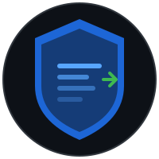

<p align="center">
  
</p>

# cee-exporter

[](https://github.com/fjacquet/cee-exporter/actions/workflows/ci.yml?query=branch%3Amain)
[](https://github.com/fjacquet/cee-exporter/actions/workflows/docs-lint.yml?query=branch%3Amain)
[](https://github.com/fjacquet/cee-exporter/actions/workflows/docs.yml?query=branch%3Amain)
[](https://github.com/fjacquet/cee-exporter/actions/workflows/release.yml)

[](https://github.com/fjacquet/cee-exporter/releases/latest)
[](https://github.com/fjacquet/cee-exporter/pkgs/container/cee-exporter)
[](go.mod)
[](https://pkg.go.dev/github.com/fjacquet/cee-exporter)
[](https://goreportcard.com/report/github.com/fjacquet/cee-exporter)
[](LICENSE)

Go daemon that receives Dell PowerStore CEPA audit events (HTTP PUT / XML) and forwards them to a SIEM (GELF, syslog, or Beats) or writes them as Windows EventLog entries — native `ReportEvent` calls on Windows, binary `.evtx` files everywhere else. No external dependencies — single static binary.

## Features

- CEPA protocol compliance — RegisterRequest handshake, heartbeat ACK within 3 s
- GELF 1.1 output over UDP or TCP → Graylog (Linux primary path)
- RFC 5424 syslog output over UDP or TCP
- Beats/Lumberjack v2 output → Logstash or Graylog, with optional TLS
- Win32 EventLog via `ReportEvent` API on Windows, with a compiled message resource so Event Viewer and Event Log API readers render the real event description (not placeholder text) for IDs 4660/4663/4670; native `.evtx` files on other platforms
- Multi-target fan-out: write to multiple backends simultaneously
- TLS listener with four modes: off, manual (operator-supplied cert), ACME (automatic Let's Encrypt), and self-signed (runtime-generated, air-gapped-friendly); certificate expiry surfaced via `/health` on every request, with a warning logged when fewer than 30 days remain
- Prometheus `/metrics` endpoint on a dedicated port (default 9228)
- A Grafana dashboard for these metrics is in
  [`dashboards/cee-exporter.json`](dashboards/cee-exporter.json) — see the
  [screenshot and caveats](https://fjacquet.github.io/cee-exporter/operator-guide/#grafana-dashboard).
  It is not validated by CI — see `docs/PROMISES.md`.
- Windows Service registration (`cee-exporter.exe install`) and a hardened Linux systemd unit
- Async queue — ACKs the HTTP request immediately, processes events in background
- Structured JSON logging (`slog`) and `/health` endpoint

## Quick Start

**Docker (recommended):**

`12228` below is CEE's *own* listener port, borrowed as a default. The
CEE-to-partner port has no assigned default — you choose it, and it must match
the port in CEE's `EndPoint`. If CEE runs on this host it already owns 12228, so
publish a different host port.

```bash
docker run -d --name cee-exporter \
  -p 12228:12228 \
  -v ./config.toml:/etc/cee-exporter/config.toml:ro \
  ghcr.io/fjacquet/cee-exporter:latest
```

**Binary:**

```bash
# Download from GitHub Releases, then:
./cee-exporter -config config.toml
```

Minimal `config.toml`:

```toml
[output]
type          = "gelf"
gelf_host     = "192.168.1.50"   # your Graylog IP
gelf_port     = 12201
gelf_protocol = "tcp"            # use tcp for production

[listen]
addr = "0.0.0.0:12228"
```

### If your events come through Dell CEE, read this first

CEE will not send events to a consumer it has not registered, and it only
registers an identity present in a table compiled into its own binary
(`CGuidStore`, keyed by *(friendlyName, facility)* → GUID). A self-generated
GUID is refused with `unknown or invalid GUID`; CEE then answers every array
heartbeat `0x16 CEPP_NOT_FOUND` and the array silently discards its events.
Every observable stays green while nothing is published.

So the `[cepa]` block is not optional in that topology:

```toml
[cepa]
friendly_name = "PeerSoftwareCollector"                  # must match CEE's EndPoint partner id
guid          = "49f4da0f-055f-401c-9f83-a95ce61447f6"   # must be that name's GUID for the facility
```

with CEE configured as
`EndPoint = PeerSoftwareCollector@http://<this-host>:<port>`.

These are other vendors' registered identities — there is no mechanism for a
third-party consumer to obtain its own. Choose deliberately: CEE will report
your consumer under that name, and it would collide with a genuine deployment
of that product on the same CEE host. Diagnosing any of this needs `Debug=63`
on the CEE side; at the default `Debug=1` CEE says nothing about why it refused.

Arrays that speak CEPA directly (PowerScale/OneFS) need none of this.

Check health:

```bash
curl http://localhost:12228/health
```

## Building from Source

Requires Go 1.26.6, no CGO.

```bash
make build-linux    # Linux/amd64   → ./cee-exporter
make build-windows  # Windows/amd64 → ./cee-exporter.exe
make build-darwin   # macOS/native  → ./cee-exporter-darwin
make test
make lint
```

(`make build` alone runs `go build -v ./...` to check compilation — it produces no binary.)

## Documentation

Full operator guide — config reference, TLS setup, CEPA registration, troubleshooting:

**[fjacquet.github.io/cee-exporter](https://fjacquet.github.io/cee-exporter/)**

## License

See [LICENSE](LICENSE).

## Monitoring stack

`deploy/compose.yaml` brings up Prometheus and Grafana preconfigured against a
running cee-exporter, with the dashboard and alert rules provisioned:

```bash
docker compose -f deploy/compose.yaml up -d
# Grafana on :3000, Prometheus on :9090
```

The exporter itself is deliberately not part of the stack — containerising it
would change the source address CEE sees, which is the `remote` label on the
publisher-liveness metrics.
