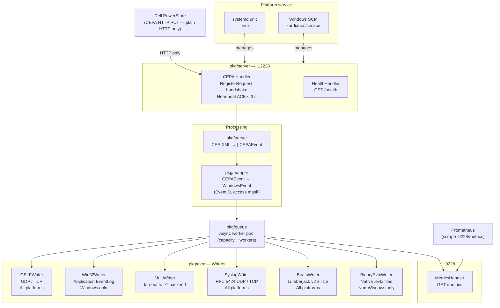

# cee-exporter

**Dell PowerStore CEPA audit events → Windows EventLog / GELF / Syslog / Beats / .evtx**

`cee-exporter` is a lightweight Go daemon that receives Dell PowerStore file-system audit events via the CEPA (Common Event Publishing Agent) HTTP protocol and forwards them to a SIEM or writes them as native Windows Event Log entries.

> **Protocol note:** The CEPA client sends events over **plain HTTP only**. Always register the `http://` URL in PowerStore — never `https://`. See [Operator Guide](operator-guide.md#registering-with-powerstore-cepa).

## Quick links

- [**Operator Guide**](operator-guide.md) — installation, configuration, TLS, CEPA registration
- [GitHub repository](https://github.com/fjacquet/cee-exporter)
- [CHANGELOG](https://github.com/fjacquet/cee-exporter/blob/main/CHANGELOG.md)
- [Releases & binaries](https://github.com/fjacquet/cee-exporter/releases)
- [Docker image](https://ghcr.io/fjacquet/cee-exporter)

## Architecture overview (v2)

## Key properties

| Property | Value |
|----------|-------|
| Listen port (CEPA) | 12228/TCP (configurable) |
| Listen port (metrics) | 9228/TCP (configurable) |
| Default output | GELF UDP → localhost:12201 |
| Binary size | ~6 MB (stripped, CGO_ENABLED=0) |
| Dependencies | Fully static binary (CGO disabled) |
| Platforms | Linux/amd64, Windows/amd64 |
| Go version | 1.24+ |

## Output writers

| Type | Description | Platform |
|------|-------------|----------|
| `gelf` | GELF 1.1 JSON over UDP or TCP → Graylog | All |
| `evtx` | Win32 `ReportEvent` → Windows Application Event Log | Windows |
| `syslog` | RFC 5424 structured syslog over UDP or TCP | All |
| `beats` | Lumberjack v2 to Logstash / Graylog Beats Input (± TLS) | All |
| `binary-evtx` | Native `.evtx` files readable by Windows Event Viewer | Non-Windows |
| `multi` | Fan-out to any combination of the above | All |

## Documentation

- [**Operator Guide**](operator-guide.md) — installation, all config fields, TLS setup, CEPA registration, troubleshooting
- [**Product Requirements (PRD)**](PRD.md) — problem statement, goals, personas, v2 requirements
- [**v2.0 Research Notes**](v2-research.md) — technology stack decisions, pitfalls, CEPA protocol findings
- **Architecture Decision Records:**
  - [ADR-001](adr/ADR-001-language-go.md) — Go as implementation language
  - [ADR-002](adr/ADR-002-gelf-primary-linux.md) — GELF as primary Linux output
  - [ADR-003](adr/ADR-003-async-queue.md) — Async queue for CEPA ACK timing
  - [ADR-004](adr/ADR-004-binary-evtx-deferred.md) — BinaryEvtxWriter deferred to v2
  - [ADR-005](adr/ADR-005-cgo-disabled.md) — CGO disabled for static linking
  - [ADR-006](adr/ADR-006-prometheus-separate-port.md) — Prometheus on port 9228
  - [ADR-007](adr/ADR-007-windows-svc-x-sys.md) — ~~x/sys direct~~ (superseded)
  - [ADR-008](adr/ADR-008-rfc5424-crewjam.md) — crewjam/rfc5424 for SyslogWriter
  - [ADR-009](adr/ADR-009-binary-evtx-scratch.md) — BinaryEvtxWriter from scratch
  - [ADR-010](adr/ADR-010-kardianos-service-windows-scm.md) — kardianos/service for Windows SCM
  - [ADR-011](adr/ADR-011-tls-certificate-automation.md) — Three-mode TLS (off/manual/acme/self-signed)
