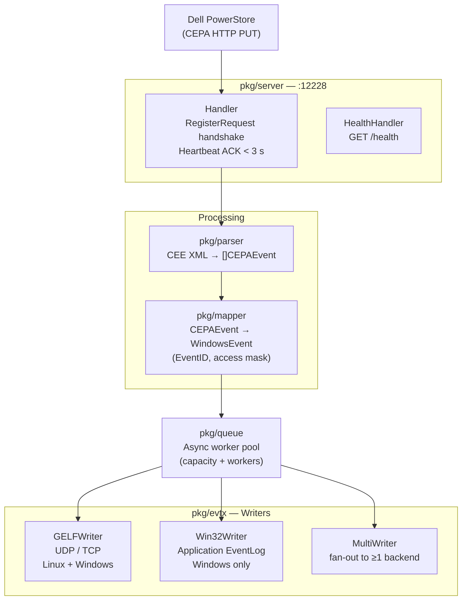

# cee-exporter

**Dell PowerStore CEPA audit events → Windows EventLog / GELF**

`cee-exporter` is a lightweight Go daemon that receives Dell PowerStore file-system audit events via the CEPA (Common Event Publishing Agent) HTTP protocol and forwards them to a SIEM as native Windows Event Log entries or GELF (Graylog Extended Log Format) messages.

## Quick links

- [**Operator Guide**](operator-guide.md) — installation, configuration, TLS, CEPA registration
- [GitHub repository](https://github.com/fjacquet/cee-exporter)
- [CHANGELOG](https://github.com/fjacquet/cee-exporter/blob/main/CHANGELOG.md)
- [Releases & binaries](https://github.com/fjacquet/cee-exporter/releases)
- [Docker image](https://ghcr.io/fjacquet/cee-exporter)

## Architecture overview

## Key properties

| Property | Value |
|----------|-------|
| Listen port | 12228/TCP (configurable) |
| Default output | GELF UDP → localhost:12201 |
| Binary size | ~6 MB (stripped, CGO_ENABLED=0) |
| Dependencies | None — fully static binary |
| Platforms | Linux/amd64, Windows/amd64 |
| Go version | 1.24+ |

## Documentation

- [**Operator Guide**](operator-guide.md) — installation, all config fields, TLS setup, CEPA registration, troubleshooting
- [**Product Requirements (PRD)**](PRD.md) — problem statement, goals, personas, architecture
- [**Architecture Decision Records**](adr/ADR-001-language-go.md) — key design decisions with context and consequences
