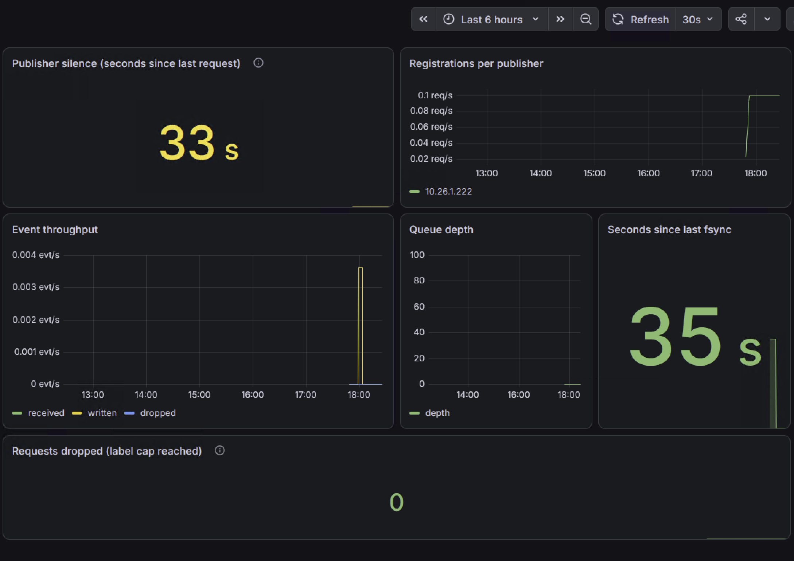
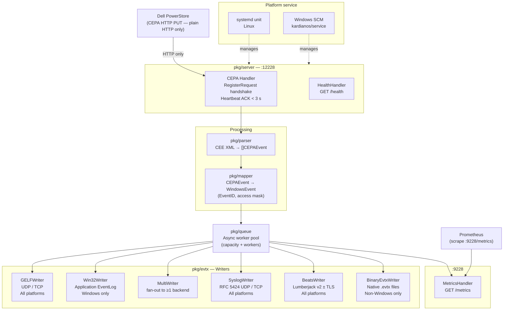

# cee-exporter

**Dell PowerStore CEPA audit events → Windows EventLog / GELF / Syslog / Beats / .evtx**

`cee-exporter` is a lightweight Go daemon that receives Dell PowerStore file-system audit events via the CEPA (Common Event Publishing Agent) HTTP protocol and forwards them to a SIEM or writes them as native Windows Event Log entries.

> **Protocol note:** The CEPA client sends events over **plain HTTP only**. Always register the `http://` URL in PowerStore — never `https://`. See [Operator Guide](operator-guide.md#registering-with-powerstore-cepa).

## Quick links

- [**Operator Guide**](operator-guide.md) — installation, configuration, TLS, CEPA registration
- [GitHub repository](https://github.com/fjacquet/cee-exporter)
- [CHANGELOG](https://github.com/fjacquet/cee-exporter/blob/main/CHANGELOG.md)
- [Releases & binaries](https://github.com/fjacquet/cee-exporter/releases)
- [Docker image](https://ghcr.io/fjacquet/cee-exporter)

## What it looks like running

*The bundled dashboard (`dashboards/cee-exporter.json`) against a live estate —
Grafana 11.5.1, 2026-08-22. Click for full resolution; the panel-by-panel
reading, and what the capture does **not** prove, is in the
[operator guide](operator-guide.md#grafana-dashboard).*

## Architecture overview (v2)

```mermaid
flowchart TD
    PS["Dell PowerStore\n(CEPA HTTP PUT — plain HTTP only)"]
    Prom["Prometheus\n(scrape :9228/metrics)"]

    subgraph server["pkg/server — :12228"]
        H["CEPA Handler\nRegisterRequest handshake\nHeartbeat ACK < 3 s"]
        HH["HealthHandler\nGET /health"]
    end

    subgraph metrics_srv[":9228"]
        MH["MetricsHandler\nGET /metrics"]
    end

    subgraph proc["Processing"]
        P["pkg/parser\nCEE XML → []CEPAEvent"]
        M["pkg/mapper\nCEPAEvent → WindowsEvent\n(EventID, access mask)"]
    end

    Q["pkg/queue\nAsync worker pool\n(capacity + workers)"]

    subgraph writers["pkg/evtx — Writers"]
        GW["GELFWriter\nUDP / TCP\nAll platforms"]
        WW["Win32Writer\nApplication EventLog\nWindows only"]
        MW["MultiWriter\nfan-out to ≥1 backend"]
        SW["SyslogWriter\nRFC 5424 UDP / TCP\nAll platforms"]
        BW["BeatsWriter\nLumberjack v2 ± TLS\nAll platforms"]
        EW["BinaryEvtxWriter\nNative .evtx files\nNon-Windows only"]
    end

    subgraph svc["Platform service"]
        SL["systemd unit\nLinux"]
        SW2["Windows SCM\nkardianos/service"]
    end

    PS -->|HTTP only| H
    H --> P
    P --> M
    M --> Q
    Q --> GW & WW & MW & SW & BW & EW
    Q --> MH
    Prom --> MH
    SL -.manages.-> server
    SW2 -.manages.-> server
```

## Key properties

| Property | Value |
|----------|-------|
| Listen port (CEPA) | 12228/TCP (configurable) |
| Listen port (metrics) | 9228/TCP (configurable) |
| Default output | GELF UDP → localhost:12201 |
| Binary size | ~11.5 MB (stripped, CGO_ENABLED=0, linux/amd64 — 12,099,746 bytes measured on the released `v5.3.1` artifact, 2026-08-11; grown from an earlier ~6 MB as dependencies were added) |
| Dependencies | CGO disabled on every platform; the Linux binaries are fully static (no `NEEDED` entries — asserted on every push and every tag). The macOS binaries link the system `libSystem`/`CoreFoundation`/`Security` libraries, as every Go binary on macOS does |
| Platforms | Linux and macOS on amd64 and arm64; Windows on amd64 (see table below) |
| Go version | 1.26.6 |

## Supported platforms

| Platform | Architectures | Release artifact |
|---|---|---|
| Linux | amd64, arm64 | `tar.gz` |
| Windows | amd64 | `zip` |
| macOS | amd64, arm64 | `tar.gz` |

This table describes the **next** release. The currently downloadable
`v4.1.3` predates the change and still includes a `windows_arm64` zip.

Windows on ARM64 was removed from the GoReleaser build matrix deliberately.
The exporter runs on a server receiving events from a PowerStore array,
Windows Server does not ship for ARM64, and no CI runner exists to test it —
so the artifact was published every release without ever being executed.

The Win32 EventLog writer (`evtx` on Windows) is Windows-only. `SIGHUP`-triggered
EVTX rotation (see [Operator Guide](operator-guide.md#triggering-rotation-manually))
is non-Windows only — the signal does not exist on Windows, so the handler is
compiled out there.

## Output writers

| Type | Description | Platform |
|------|-------------|----------|
| `gelf` | GELF 1.1 JSON over UDP or TCP → Graylog | All |
| `evtx` | Win32 EventLog API on Windows (real event descriptions via a compiled message resource — see [Windows Verification Protocol](windows-verification.md)); native `.evtx` files on all other platforms | All |
| `syslog` | RFC 5424 structured syslog over UDP or TCP | All |
| `beats` | Lumberjack v2 to Logstash / Graylog Beats Input (± TLS) | All |
| `multi` | Fan-out to any combination of the above | All |

## Documentation

- [**Operator Guide**](operator-guide.md) — installation, all config fields, TLS setup, CEPA registration, troubleshooting
- [**Windows Verification Protocol**](windows-verification.md) — manual Event Viewer verification for the Win32 writer's message rendering and registration upgrade path
- [**Product Requirements (PRD)**](PRD.md) — problem statement, goals, personas, v2 requirements
- [**v2.0 Research Notes**](v2-research.md) — technology stack decisions, pitfalls, CEPA protocol findings
- [**Research Archive**](research/index.md) — full phase-by-phase research (stack, architecture, pitfalls, code examples)
- **Architecture Decision Records:**
  - [ADR-001](adr/ADR-001-language-go.md) — Go as implementation language
  - [ADR-002](adr/ADR-002-gelf-primary-linux.md) — GELF as primary Linux output
  - [ADR-003](adr/ADR-003-async-queue.md) — Async queue for CEPA ACK timing
  - [ADR-004](adr/ADR-004-binary-evtx-deferred.md) — BinaryEvtxWriter deferred to v2
  - [ADR-005](adr/ADR-005-cgo-disabled.md) — CGO disabled for static linking
  - [ADR-006](adr/ADR-006-prometheus-separate-port.md) — Prometheus on port 9228
  - [ADR-007](adr/ADR-007-windows-svc-x-sys.md) — ~~x/sys direct~~ (superseded)
  - [ADR-008](adr/ADR-008-rfc5424-crewjam.md) — crewjam/rfc5424 for SyslogWriter
  - [ADR-009](adr/ADR-009-binary-evtx-scratch.md) — BinaryEvtxWriter from scratch
  - [ADR-010](adr/ADR-010-kardianos-service-windows-scm.md) — kardianos/service for Windows SCM
  - [ADR-011](adr/ADR-011-tls-certificate-automation.md) — Four-mode TLS (off/manual/acme/self-signed)
  - [ADR-012](adr/ADR-012-flush-ticker-ownership.md) — Flush ticker ownership inside BinaryEvtxWriter
  - [ADR-013](adr/ADR-013-write-on-close-model.md) — Write-on-close model
  - [ADR-014](adr/ADR-014-go-evtx-library-extraction.md) — go-evtx extracted to its own module
  - [ADR-015](adr/ADR-015-windows-message-resource.md) — Windows message resource compiled into the binary
  - [ADR-016](adr/ADR-016-three-oracle-evtx-verification.md) — Three-oracle EVTX read-back verification
  - [ADR-017](adr/ADR-017-cee-partner-identity.md) — Register with CEE under an allowlisted partner identity
