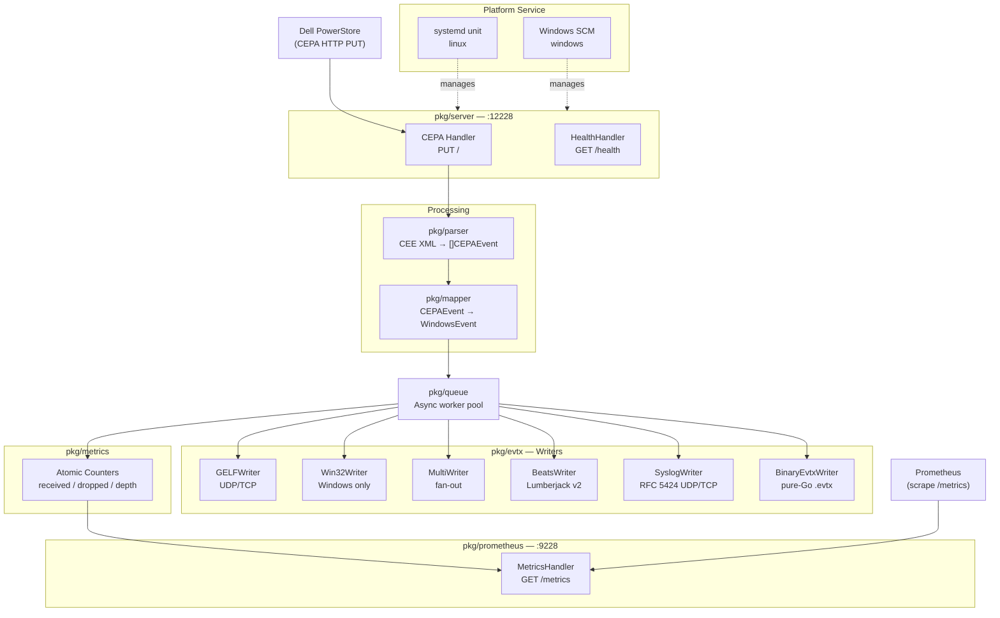
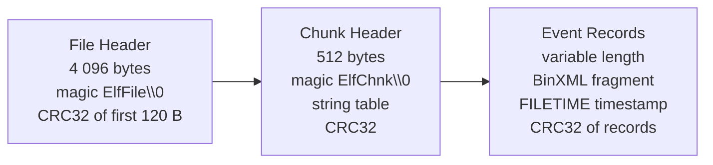

# v2.0 Research Notes

Research conducted 2026-03-03 before milestone planning. Covers technology stack
selection, feature design, architecture integration, and known pitfalls for the six
new capabilities added in v2.0.

---

## v2.0 Feature Overview

| Feature | Category | Complexity | New Dependency |
|---------|----------|------------|----------------|
| Prometheus `/metrics` endpoint | Table stakes | Low | `prometheus/client_golang` v1.23.2 |
| Systemd unit file | Table stakes | None (text artifact) | — |
| Windows Service registration | Table stakes | Medium | none (x/sys already present) |
| SyslogWriter (RFC 5424) | Table stakes | Medium | `crewjam/rfc5424` v0.1.0 |
| BeatsWriter (Lumberjack v2) | Differentiator | Medium | `elastic/go-lumber` v0.1.1 |
| BinaryEvtxWriter (pure-Go BinXML) | Differentiator | High | none (stdlib only) |

---

## Architecture Overview (v2)

---

## Technology Stack Decisions

### What was already in v1

| Package | Version | Role |
|---------|---------|------|
| `net/http` | stdlib | CEPA listener, TLS |
| `encoding/xml` | stdlib | CEPA XML parsing |
| `log/slog` | stdlib | Structured logging |
| `github.com/BurntSushi/toml` | v1.6.0 | Config parsing |
| `golang.org/x/sys` | v0.31.0 | Win32 EventLog API |

### New dependencies in v2

| Package | Version | Feature | CGO-free |
|---------|---------|---------|----------|
| `github.com/prometheus/client_golang` | v1.23.2 | Prometheus /metrics | Yes |
| `github.com/elastic/go-lumber` | v0.1.1 | BeatsWriter | Yes |
| `github.com/crewjam/rfc5424` | v0.1.0 | SyslogWriter | Yes |

**No new dependencies for:** Systemd unit file (text artifact), Windows Service
(`x/sys` already present), BinaryEvtxWriter (stdlib only).

---

## Key Architectural Decisions

### Prometheus: Separate Port 9228

The CEPA listener (`:12228`) may be TLS-only in production. Mounting `/metrics` on the
same mux would require every Prometheus scraper to handle TLS. Industry practice for Go
exporters is a dedicated port in the `9xxx` range. **Port 9228** follows from `12228`
by convention. See [ADR-006](adr/ADR-006-prometheus-separate-port.md).

### Windows Service: x/sys/windows/svc (not kardianos/service)

`golang.org/x/sys/windows/svc` is already in `go.mod` for the Win32 EventLog writer.
`kardianos/service` is a wrapper that adds no functionality over `x/sys` for this
use case. See [ADR-007](adr/ADR-007-windows-svc-x-sys.md).

### Syslog: crewjam/rfc5424 (not stdlib log/syslog)

stdlib `log/syslog` has the build constraint `//go:build !windows` and does not compile
on Windows. It also produces RFC 3164 format (no structured data). `crewjam/rfc5424`
is pure Go, cross-platform, and produces correct RFC 5424 SD-ELEMENTs.
See [ADR-008](adr/ADR-008-rfc5424-crewjam.md).

### BinaryEvtxWriter: Implement from scratch

No pure-Go EVTX *writer* library exists — all known Go EVTX projects are parsers only.
The implementation uses only stdlib (`encoding/binary`, `hash/crc32`, `unicode/utf16`).
Estimated at 600–1 200 LOC; assigned its own roadmap phase.
See [ADR-009](adr/ADR-009-binary-evtx-scratch.md).

---

## Prometheus Metric Definitions

The existing `pkg/metrics` atomic counters map directly to Prometheus metrics:

| Metric | Type | Source |
|--------|------|--------|
| `cee_events_received_total` | Counter | `metrics.M.EventsReceivedTotal` |
| `cee_events_dropped_total` | Counter | `metrics.M.EventsDroppedTotal` |
| `cee_events_written_total` | Counter | `metrics.M.EventsWrittenTotal` |
| `cee_writer_errors_total` | Counter | `metrics.M.WriterErrorsTotal` |
| `cee_queue_depth` | Gauge | `metrics.M.QueueDepth()` |

Counters use `prometheus.NewCounterFunc` wrapping the existing atomics. No state
duplication. Queue depth uses `prometheus.NewGaugeFunc`.

---

## BinaryEvtxWriter — Format Summary

The EVTX binary format (per [MS-EVEN6]) has three layers:

Key constraints:

- Chunks are exactly 65 536 bytes; new chunk on overflow.
- Each record carries a globally-monotonic `EventRecordID`.
- Timestamps are Windows FILETIME (100 ns intervals since 1601-01-01).
- BinXML strings are UTF-16LE encoded.
- v2 implementation: self-contained BinXML fragments per event (no cross-event
  template sharing). Larger files, simpler implementation, 100% spec-compliant.

---

## Known Pitfalls

Critical issues identified during research:

| Area | Pitfall | Prevention |
|------|---------|------------|
| BinaryEvtxWriter | CRC32 must use the ANSI polynomial, not IEEE | Use `crc32.ChecksumIEEE` — Go's default IS the ANSI poly |
| BinaryEvtxWriter | FILETIME epoch is 1601-01-01, not Unix 1970 | Add 116 444 736 000 000 000 to Unix nanoseconds / 100 |
| BinaryEvtxWriter | String table offsets are relative to chunk start | All offsets computed from chunk base, not file base |
| Prometheus | Registering on `prometheus.DefaultRegisterer` breaks tests | Use a custom `prometheus.NewRegistry()` |
| Windows Service | `svc.IsWindowsService()` must be called before any log output | Detect SCM context as the first action in `main()` |
| SyslogWriter | SD-PARAM values must escape `"`, `\`, `]` | `crewjam/rfc5424` handles this; do not pre-escape |
| BeatsWriter | go-lumber `SyncClient` blocks until ACK | Use the existing `pkg/queue` async layer; never call from handler goroutine |

---

## Sources

- [prometheus/client_golang GitHub](https://github.com/prometheus/client_golang) — v1.23.2, 2025-09-05
- [elastic/go-lumber GitHub](https://github.com/elastic/go-lumber) — v0.1.1, Lumberjack v2
- [crewjam/rfc5424 GitHub](https://github.com/crewjam/rfc5424) — v0.1.0, RFC 5424 read/write
- [golang.org/x/sys/windows/svc](https://pkg.go.dev/golang.org/x/sys/windows/svc) — Windows Service API
- [MS-EVEN6 BinXML spec](https://learn.microsoft.com/en-us/openspecs/windows_protocols/ms-even6/e6fc7c72-b8c0-475b-aef7-25eaf1a64530)
- [libyal/libevtx format docs](https://github.com/libyal/libevtx/blob/main/documentation/Windows%20XML%20Event%20Log%20(EVTX).asciidoc)
- [RFC 5424](https://www.rfc-editor.org/rfc/rfc5424) — The Syslog Protocol
