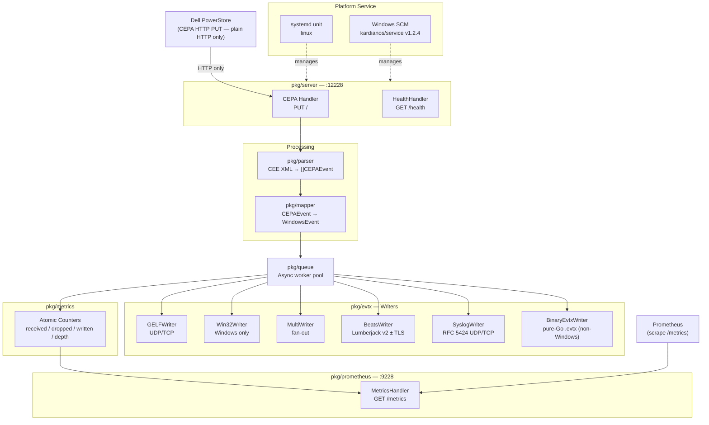
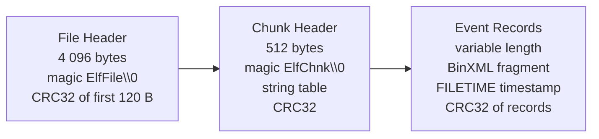

# v2.0 Research Notes

Research conducted 2026-03-03 before milestone planning. Covers technology stack
selection, feature design, architecture integration, and known pitfalls for the six
new capabilities added in v2.0, plus Phase 8 TLS automation.

---

## v2.0 Feature Overview

| Feature | Category | Complexity | New Dependency |
|---------|----------|------------|----------------|
| Prometheus `/metrics` endpoint | Table stakes | Low | `prometheus/client_golang` v1.23.2 |
| Systemd unit file | Table stakes | None (text artifact) | — |
| Windows Service registration | Table stakes | Medium | `kardianos/service` v1.2.4 |
| SyslogWriter (RFC 5424) | Table stakes | Medium | `crewjam/rfc5424` v0.1.0 |
| BeatsWriter (Lumberjack v2) | Differentiator | Medium | `elastic/go-lumber` v0.1.1 |
| BinaryEvtxWriter (pure-Go BinXML) | Differentiator | High | none (stdlib only) |
| TLS certificate automation (ACME) | Operations | Low-Medium | `x/crypto/acme/autocert` (promoted) |

---

## Critical Protocol Finding: CEPA Uses HTTP Only

> **Confidence: MEDIUM** (multiple third-party guides confirm; Dell official docs blocked)

The Dell PowerStore CEPA client sends events over **plain HTTP only**. The canonical
CEPA endpoint format is `ApplicationName@http://<IP>:<Port>`. No HTTPS variant exists
in CEPA configuration documentation. Dell's own documentation states:

> "When a host generates an event on the file system over SMB or NFS, the information
> is forwarded to the CEPA server over an **HTTP connection**."

**Impact for TLS configuration:**

Enabling TLS on the cee-exporter CEPA listener (port 12228) does NOT encrypt the
PowerStore-to-exporter connection — the PowerStore will fail to complete TLS handshake
because it only issues plain HTTP. TLS on port 12228 is useful **only** if:

- A TLS-capable reverse proxy sits in front of cee-exporter
- A future PowerStore firmware version adds HTTPS receiver support

The existing `ListenConfig.TLS` infrastructure is preserved for these cases. Phase 8
adds ACME automation (see below), but operators must understand the protocol limitation.

---

## Architecture Overview (v2)

---

## Technology Stack Decisions

### What was already in v1

| Package | Version | Role |
|---------|---------|------|
| `net/http` | stdlib | CEPA listener, TLS |
| `encoding/xml` | stdlib | CEPA XML parsing |
| `log/slog` | stdlib | Structured logging |
| `github.com/BurntSushi/toml` | v1.6.0 | Config parsing |
| `golang.org/x/sys` | v0.31.0 | Win32 EventLog API |

### New dependencies in v2

| Package | Version | Feature | CGO-free |
|---------|---------|---------|----------|
| `github.com/prometheus/client_golang` | v1.23.2 | Prometheus /metrics | Yes |
| `github.com/elastic/go-lumber` | v0.1.1 | BeatsWriter | Yes |
| `github.com/crewjam/rfc5424` | v0.1.0 | SyslogWriter | Yes |
| `github.com/kardianos/service` | v1.2.4 | Windows SCM service | Yes |
| `golang.org/x/crypto` (promoted) | v0.48.0 | ACME autocert | Yes |

**No new dependencies for:** Systemd unit file (text artifact), BinaryEvtxWriter (stdlib only).

---

## Key Architectural Decisions

### Prometheus: Separate Port 9228

The CEPA listener (`:12228`) may be TLS-only in production. Mounting `/metrics` on the
same mux would require every Prometheus scraper to handle TLS. Industry practice for Go
exporters is a dedicated port in the `9xxx` range. **Port 9228** follows from `12228`
by convention. See [ADR-006](adr/ADR-006-prometheus-separate-port.md).

### Windows Service: kardianos/service v1.2.4 (not x/sys direct)

Phase 5 research revised the initial ADR-007 decision. Direct use of `x/sys/windows/svc`
misses three critical features that `kardianos/service` provides:

1. `SetRecoveryActionsOnNonCrashFailures(true)` — ensures restart fires on `os.Exit(1)`,
   not only on true crashes. Without it, Go processes that exit cleanly with an error
   code are NOT restarted by SCM.
2. `DelayedAutoStart: true` — prevents Event ID 7009 (30-second SCM startup timeout)
   during system boot when disk/CPU are contended.
3. Edge-case handling in `Install()`/`Uninstall()` for common SCM error codes.

See [ADR-010](adr/ADR-010-kardianos-service-windows-scm.md) (supersedes ADR-007).

### Syslog: crewjam/rfc5424 (not stdlib log/syslog)

stdlib `log/syslog` has the build constraint `//go:build !windows` and does not compile
on Windows. It also produces RFC 3164 format (no structured data). `crewjam/rfc5424`
is pure Go, cross-platform, and produces correct RFC 5424 SD-ELEMENTs with automatic
SD-PARAM escaping (`"`, `\`, `]`). See [ADR-008](adr/ADR-008-rfc5424-crewjam.md).

### BeatsWriter: go-lumber SyncClient with TLS dialer injection

`github.com/elastic/go-lumber/client/v2` exposes `SyncDialWith(dialFn, addr, opts...)` —
the only way to add TLS is to inject a `tls.Dialer`-backed dial function. There is no
built-in TLS option. `SyncClient` is **not thread-safe** — every `Send` call must be
serialized with `sync.Mutex`. After any `Send` error, the client cannot be reused —
close and recreate. Lumberjack v2 ACK semantics guarantee no data loss on network
failure when using `SyncClient.Send` (blocks until ACK received).

### BinaryEvtxWriter: Implement from scratch

No pure-Go EVTX *writer* library exists as of 2026-03. All Go EVTX projects are
parsers only. The implementation uses only stdlib. See [ADR-009](adr/ADR-009-binary-evtx-scratch.md).

### TLS Certificate Automation: autocert (not lego, not manual-only)

`golang.org/x/crypto/acme/autocert` provides HTTP-01 and TLS-ALPN-01 challenge support
with automatic renewal. A separate port-443 listener goroutine handles TLS-ALPN-01
challenges independent of the CEPA listener on 12228. Self-signed mode uses stdlib
`crypto/ecdsa` + `crypto/x509` — no network, no external tools.

See [ADR-011](adr/ADR-011-tls-certificate-automation.md).

---

## Prometheus Metric Definitions

The existing `pkg/metrics` atomic counters map directly to Prometheus metrics:

| Metric | Type | Source |
|--------|------|--------|
| `cee_events_received_total` | Counter | `metrics.M.EventsReceivedTotal` |
| `cee_events_dropped_total` | Counter | `metrics.M.EventsDroppedTotal` |
| `cee_events_written_total` | Counter | `metrics.M.EventsWrittenTotal` |
| `cee_writer_errors_total` | Counter | `metrics.M.WriterErrorsTotal` |
| `cee_queue_depth` | Gauge | `metrics.M.QueueDepth()` |

Counters use `prometheus.NewCounterFunc` wrapping the existing atomics. No state
duplication. Queue depth uses `prometheus.NewGaugeFunc`.

---

## BinaryEvtxWriter — Format Summary

The EVTX binary format (per [MS-EVEN6]) has three layers:

Key constraints:

- Chunks are exactly 65 536 bytes; new chunk on overflow.
- Each record carries a globally-monotonic `EventRecordID`.
- Timestamps are Windows FILETIME (100 ns intervals since 1601-01-01 UTC).
  Conversion: `uint64(t.UTC().UnixNano()/100 + 116444736000000000)`
- BinXML strings are UTF-16LE encoded (use `unicode/utf16` stdlib).
- v2 implementation: self-contained BinXML fragments per event (no cross-event
  template sharing — OUT-F01 deferred). Larger files, simpler implementation.
- Chunk header CRC32 covers bytes 0-119 **and** 128-511 (NOT bytes 120-127).
  The CRC field itself (bytes 124-127) must be zeroed before computing.
- Test oracle: `github.com/0xrawsec/golang-evtx` (test-only dep, not runtime).

---

## TLS Automation — Configuration Modes

| `tls_mode` | When to use | Network requirements |
|------------|-------------|---------------------|
| `"off"` | CEPA deployments (HTTP-only protocol) | None |
| `"manual"` | Operator-managed certs (v1 compat) | None |
| `"acme"` | Internet-reachable hosts, automated renewal | Port 443 reachable by Let's Encrypt |
| `"self-signed"` | Air-gapped, private networks, testing | None |

Key ACME operational constraints:

- Let's Encrypt rate limit: 5 duplicate certificates per 7 days — use `acme_staging = true` during development.
- `DirCache` must be on persistent storage (mount a volume in Docker).
- Port 443 binding requires `AmbientCapabilities=CAP_NET_BIND_SERVICE` in the systemd unit.
- Windows services binding to 443 require SYSTEM account or `netsh http add urlacl`.

---

## Known Pitfalls

Critical issues identified during research across all phases:

| Area | Pitfall | Prevention |
|------|---------|------------|
| **CEPA protocol** | Registering `https://` in PowerStore CEPA config — CEPA only sends HTTP | Always use `http://` in PowerStore CEPA endpoint URL |
| BinaryEvtxWriter | CRC32 must cover bytes 0-119 AND 128-511 of chunk header (not the CRC field) | Zero bytes 124-127 before computing; patch after |
| BinaryEvtxWriter | FILETIME epoch is 1601-01-01, not Unix 1970 | Add 116 444 736 000 000 000 to `UnixNano()/100` |
| BinaryEvtxWriter | Event record size field appears at offset 4 AND as a copy at the end | Assemble in `bytes.Buffer`, patch both size fields after final length is known |
| BinaryEvtxWriter | EVTX strings are UTF-16LE, not UTF-8 | Use `unicode/utf16.Encode` + `encoding/binary.LittleEndian` |
| Prometheus | Registering on `prometheus.DefaultRegisterer` breaks parallel tests | Use a custom `prometheus.NewRegistry()` per test |
| Windows Service | `os.Exit(1)` without `FailureActionsOnNonCrashFailures` → no SCM restart | Use `kardianos/service` which sets this flag automatically |
| Windows Service | SCM 30-second startup timeout at boot for large Go binaries | `DelayedAutoStart: true` in service config |
| Windows Service | `Arguments` captured at install must not include "install" subcommand | Strip subcommand before storing SCM arguments |
| Windows Service | SCM `Stop()` does not send POSIX signals — run() won't exit | Bridge `Stop()` to a `context.CancelFunc` passed into `run()` |
| SyslogWriter | SD-PARAM values must escape `"`, `\`, `]` | `crewjam/rfc5424.AddDatum` handles this; never pre-escape |
| SyslogWriter | TCP syslog requires RFC 6587 octet-counting framing | `fmt.Fprintf(conn, "%d ", len(payload))` before write; UDP needs no framing |
| BeatsWriter | `SyncClient` is not thread-safe | Serialize all `Send` calls with `sync.Mutex` |
| BeatsWriter | `SyncClient` cannot be reused after send error | On error: `client.Close()`, recreate via `dial()`, retry once |
| ACME/TLS | Let's Encrypt rate limits hit on repeated restarts without `DirCache` | Always configure persistent `DirCache`; use staging for dev |
| ACME/TLS | ACME challenge cannot run on port 12228 (CEPA port) | TLS-ALPN-01 challenge listener must bind to port 443 separately |

---

## Sources

- [prometheus/client_golang GitHub](https://github.com/prometheus/client_golang) — v1.23.2, 2025-09-05
- [elastic/go-lumber GitHub](https://github.com/elastic/go-lumber) — v0.1.1, Lumberjack v2
- [crewjam/rfc5424 GitHub](https://github.com/crewjam/rfc5424) — v0.1.0, RFC 5424 read/write
- [kardianos/service GitHub](https://github.com/kardianos/service) — v1.2.4, July 2025
- [golang.org/x/crypto/acme/autocert](https://pkg.go.dev/golang.org/x/crypto/acme/autocert) — ACME Manager API
- [golang.org/x/sys/windows/svc](https://pkg.go.dev/golang.org/x/sys/windows/svc) — Windows Service API
- [MS-EVEN6 BinXML spec](https://learn.microsoft.com/en-us/openspecs/windows_protocols/ms-even6/e6fc7c72-b8c0-475b-aef7-25eaf1a64530)
- [libyal/libevtx format docs](https://github.com/libyal/libevtx/blob/main/documentation/Windows%20XML%20Event%20Log%20(EVTX).asciidoc)
- [RFC 5424](https://www.rfc-editor.org/rfc/rfc5424) — The Syslog Protocol
- [RFC 6587](https://www.rfc-editor.org/rfc/rfc6587) — TCP Syslog transport (octet-counting)
- [Let's Encrypt rate limits](https://letsencrypt.org/docs/rate-limits/) — 5 certs/same-set/7 days; ARI exempt
- golang/go issue #23479 — SCM 30-second startup timeout root cause for Go services
